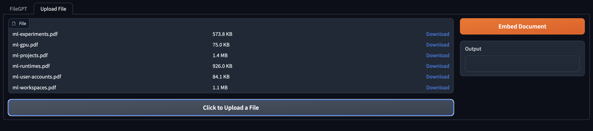
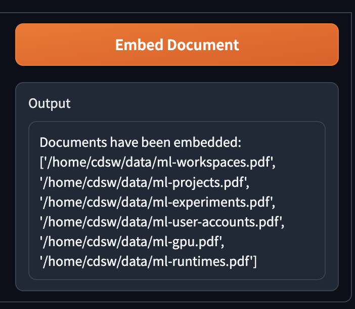
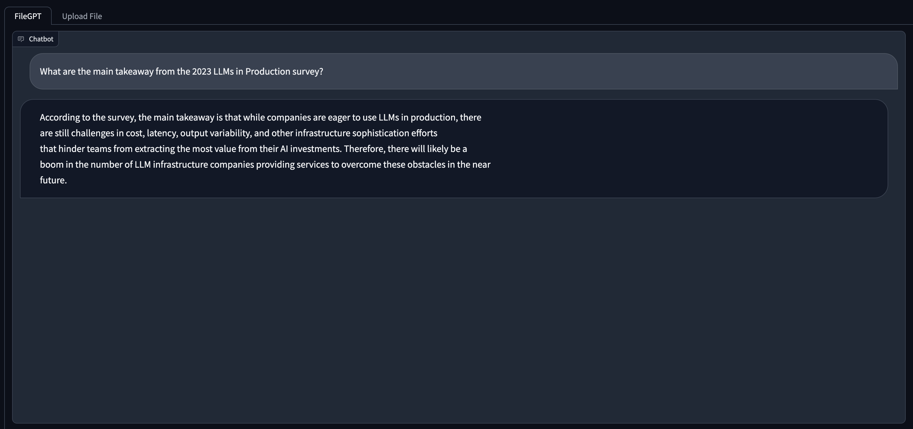

# CML PDF Document Chatbot
Git Repo for CML Document Chatbot

## Key Features

- Load PDF Documents directly from the App UI
- Chunking and Cleaning of Documents
- Model of Choice from HuggingFace
- Gradio Chatbot Interface
- Standalone Chroma VectorDB

## Prerequistes

- [Create a Standalone Chroma VectorDB instance in Azure](https://github.com/nkityd09/cml_chatbot/blob/main/amp_extensions/Azure_Setting_Up_ChromaDB.md)
- [Create a Standalone Chroma VectorDB instance in AWS](https://github.com/nkityd09/cml_chatbot/blob/main/amp_extensions/Setting_Up_ChromaDB.md)


## Features Under Development

1. Conversational Memory (**In Progress**)
2. [Support for other VectorDBs (Milvus)](https://github.com/nkityd09/cml_chatbot/issues/1)

## Resource Requirements

The AMP Application has been configured to use the following 
- 4 CPU
- 32 GB RAM
- 1 GPU

## Steps to Setup the CML AMP Application

1. Navigate to CML Workspace -> Site Administration -> AMPs Tab

2. Under AMP Catalog Sources section, We will "Add a new source By" selecting "Catalog File URL" 

3. Provide the following URL and click "Add Source"

```
https://raw.githubusercontent.com/nkityd09/cml_chatbot/main/catalog.yaml
```

4. Once added, We will be able to see the LLM PDF Document Chatbot in the AMP section and deploy it from there.

5. During AMP deployment, we can set three environment varibales
   - **VectorDB_IP:-** (Specify the Public IP address of host where ChromaDB is running)
   - **HF_MODEL:-** HuggingFace Model Name (Defaults to mistralai/Mistral-7B-v0.1, please include the complete name of the model)
   - **HF_TOKEN:-** Provide HuggingFace Access Token for accessing Gated models like Falcon180B and Llama-2

6. Click on the AMP and "Configure Project", disable Spark as it is not required.

7. Once the AMP steps are completed, We can access the Gradio UI via the Applications page.

**Note**: The application creates a "default" collection in the VectorDB when the AMP is launched the first time.

## Steps to Use the Gradio App

1. Navigate to the "Upload File" Tab and use the "Click to Upload Button" to upload a file



2. Once the files have been uploaded, use the "Embed Document" button to store the document into VectorDB

**Note Embedding documents is lenghty process and can take some time to complete.**



3. Once Embedding has completed, switch to the FileGPT tab and enter your questions via the textbox and Submit button below.



## Video Demo

https://github.com/nkityd09/cml_chatbot/assets/101132317/0307ad7e-3e0c-48ee-bfed-2e6afeaafd5a
