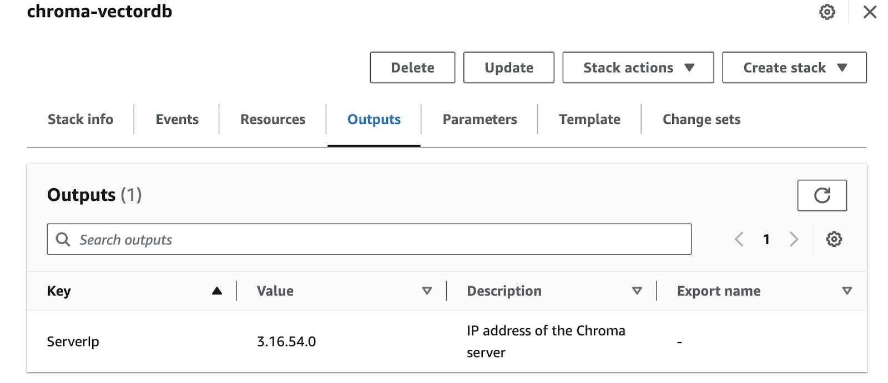

# Setting UP Independent ChromaDB

The current implementation uses an in-memory version of ChromaDB which is great for prototyping and demos, however, real world production use cases require a standalone VectorDB where data can be stored.

To facilitate this, I have tested the deployment of Chroma on a long-running server, and connect to it remotely via the AMP Application. Chroma provides a CloudFormation stack which can be used to deploy an EC2 instance with Chroma running on it via Docker. The application is accessible via port 8000 and the Public IP address of the instance.

The official documentation and steps can be found [here](https://docs.trychroma.com/deployment).

## Steps to deploy standalone ChromaDB

1. Copy the below S3 URL which stores the Chroma Cloudformation Stack
```
https://s3.amazonaws.com/public.trychroma.com/cloudformation/latest/chroma.cf.json
```

2. Navigate to AWS Console and the CloudFormation Service
3. Click “Create Stack” “with new resources” and provide the above URL under “Amazon S3 URL”
4. Give the stack a name, optionally change the Instance Type, if needed. Provide a Key pair name which can be used to access the EC2 instance
5. Add Tags if required and then Click “Next”
6. Review all settings and Click “Submit”
7. Once the stack creation  completes successfully, navigate to the Outputs Tab to see the Public IP of the instance



## Setting the AMP Application to use Standalone Chroma

Open the gradio_app/app.py file for editing and make the following changes

Add the following Import statements
```python
__import__('pysqlite3')
import sys
sys.modules['sqlite3'] = sys.modules.pop('pysqlite3')
```
Add the following Code snippet with the Public IP of the Server from the Chroma Cloudformation Outputs
```python
IP_ADDR="3.16.54.0" #Change to your Chroma Public IP
chroma = chromadb.HttpClient(host=IP_ADDR, port=8000)
```
Initialize the Langchain Chroma library with client details
```python
langchain_chroma = Chroma(
    client=chroma,
    collection_name="volkswagen_data",
    embedding_function=instructor_embeddings
)
```
Change the vector variable to use the new langchain_chroma client
```python
### create embeddings and DB
vectordb = langchain_chroma.from_documents(documents=texts,
                                 embedding=embedding_function)
```
